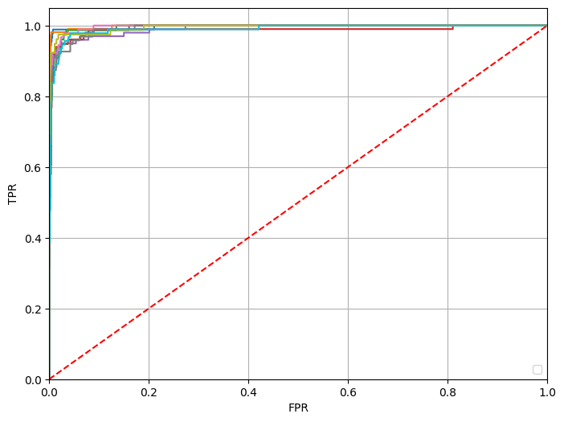

# Лабораторная работа № 3

## Результаты работы

Сверточная нейронная сеть состоит из разных видов слоев: сверточные (convolutional) слои, слои пулинга (subsampling) и полносвязные слои, в соответствии с рисунком.

Первые два типа слоев (convolutional, subsampling), чередуясь между собой, формируют входной вектор признаков для полносвязных слоев.

Свое название сверточная сеть получила по названию операции – свертка, суть которой будет описана дальше.

1. Сверточные слои

Сверточный слой представляет из себя набор карт (другое название – карты признаков, в обиходе это обычные матрицы), у каждой карты есть синаптическое ядро (в разных источниках его называют по-разному: сканирующее ядро или фильтр).
Ядро представляет из себя фильтр или окно, которое скользит по всей области предыдущей карты и находит определенные признаки объектов. Например, если сеть обучали на множестве лиц, то одно из ядер могло бы в процессе обучения выдавать наибольший сигнал в области глаза, рта, брови или носа, другое ядро могло бы выявлять другие признаки. Размер ядра обычно берут в пределах от 3х3 до 7х7. Если размер ядра маленький, то оно не сможет выделить какие-либо признаки, если слишком большое, то увеличивается количество связей между нейронами. Также размер ядра выбирается таким, чтобы размер карт сверточного слоя был четным, это позволяет не терять информацию при уменьшении размерности в подвыборочном слое, описанном ниже.

Ядро представляет собой систему разделяемых весов или синапсов, это одна из главных особенностей сверточной нейросети. В обычной многослойной сети очень много связей между нейронами, то есть синапсов, что весьма замедляет процесс детектирования. В сверточной сети – наоборот, общие веса позволяет сократить число связей и позволить находить один и тот же признак по всей области изображения.

Неформально эту операцию можно описать следующим образом — окном размера ядра g проходим с заданным шагом (обычно 1) все изображение f, на каждом шаге поэлементно умножаем содержимое окна на ядро g, результат суммируется и записывается в матрицу результата, как на рисунке.

2. Слои пулинга

Также в работе использовались слои пулинга. Цель слоя – уменьшение размерности карт предыдущего слоя. Если на предыдущей операции свертки уже были выявлены некоторые признаки, то для дальнейшей обработки настолько подробное изображение уже не нужно, и оно уплотняется до менее подробного. К тому же фильтрация уже ненужных деталей помогает не переобучаться.
В процессе сканирования ядром подвыборочного слоя (фильтром) карты предыдущего слоя, сканирующее ядро не пересекается в отличие от сверточного слоя. Обычно, каждая карта имеет ядро размером 2x2, что позволяет уменьшить предыдущие карты сверточного слоя в 2 раза. Вся карта признаков разделяется на ячейки 2х2 элемента, из которых выбираются максимальные или средние по значению.

3. Полносвязные слои

Последний из типов слоев это слой обычного многослойного персептрона. Цель слоя – классификация, моделирует сложную нелинейную функцию, оптимизируя которую, улучшается качество распознавания.

## Результаты работы
***
### График потерь

Как видно из графика, на 50-й эпохе лосс упал до 0.3

### ROC-кривая

Данная визуализация содержит 10 кривых, соответствующих классам.

### Матрицы ошибок

По результатам классификации можно расположить классы в следующем порядке убывания сложности распознавания:
3 > 5/9 > 7 > 8 > 2/4 > 6 > 1 > 0

### Есть ли переобучение?

Нет.

## Вывод
В рамках данной лабораторной работы мы создали простую систему классификации изображений на основе сверточной нейронной сети архитектуры LeNet-5.
